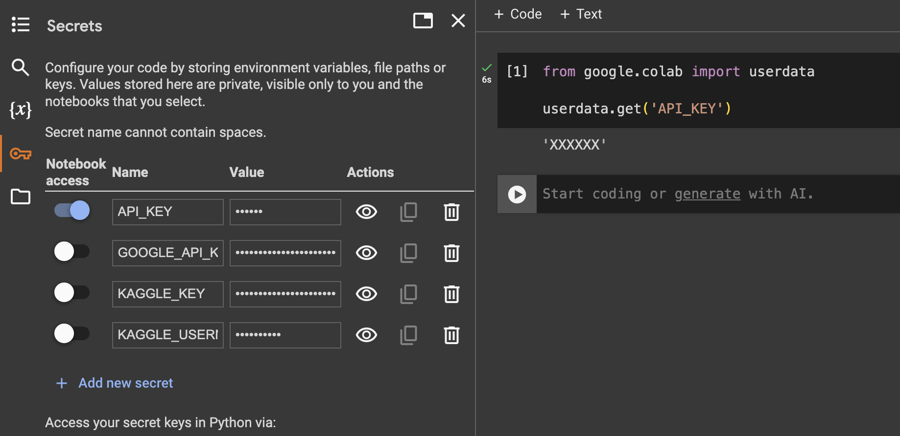

# Introduction to Python {#intro}

This chapter introduces the essential Python programming concepts you'll need to work with AI and Large Language Models through the use of APIs. While the focus of this part of the course is on understanding and using LLMs, having solid Python fundamentals will make everything else much easier. Of course, even as you learn these basics, there will still be plenty you don't know yet—and that's totally normal! When you get stuck or have questions, just do what every coder does: ask Google or ChatGPT. That's a big part of how real programming works. If you are reallu stuck, do not hesitate to ask me for help.

## Why Python for AI?

Python is the most popular language for AI and data science because:

- **Ease of use**: Its simple, readable syntax makes it easy to learn and write code quickly.
- **Automation**: Python lets you automate repetitive tasks, making workflows more efficient.
- **Vast ecosystem**: There are thousands of libraries for AI, data analysis, web development, and more (e.g., `numpy`, `pandas`, `scikit-learn`, `transformers`, `langchain`).
- **Community support**: A huge global community means lots of tutorials, forums, and help when you get stuck.

In short, Python is the "lingua franca" of AI. If you know Python, you can use almost any AI tool or library.

## Setting Up Your Environment

### Option 1: Google Colab (Recommended for Beginners)

Google Colab provides a free, cloud-based Python environment that's perfect for learning:

1. Go to [colab.research.google.com](https://colab.research.google.com)
2. Sign in with your Google account
3. Create a new notebook
4. Start coding immediately!

### Option 2: Local Installation

If you prefer to work locally, you can use Python in several ways—such as Jupyter notebooks, standalone `.py` scripts, for example through VS Code. In these cases, you'll need to first install Python, and then set up your own environment and install the necessary packages (like `pandas`, `numpy`, `matplotlib`, `requests`, `transformers`, and `langchain`). 

There are many guides online for installing Python and setting up your environment on your operating system. Search for instructions specific to your platform (Windows, macOS, or Linux) and your preferred workflow. Make sure to install the basic packages you'll need for AI and data science work before proceeding.

## Essential Python Concepts

### Variables and Data Types

Python uses dynamic typing, meaning you don't need to declare variable types explicitly. The interpreter automatically determines the type based on the value you assign.

```python
# ===== NUMBERS =====
# Integers (whole numbers)
age = 25                    # Integer type
year = 2024                 # Another integer

# Floating-point numbers (decimals)
height = 5.9                # Float type
pi = 3.14159               # Another float

# Boolean values (True/False)
is_student = True           # Boolean type
is_working = False          # Another boolean

# ===== STRINGS =====
# Text data - can use single or double quotes
name = "Alice"              # String with double quotes
message = 'Hello, World!'   # String with single quotes
multiline = """This is a
multi-line string"""        # Multi-line string

# ===== LISTS (Arrays) =====
# Ordered collections that can hold different data types
fruits = ["apple", "banana", "orange"]  # List of strings
numbers = [1, 2, 3, 4, 5]              # List of integers
mixed_list = ["apple", 42, True, 3.14]  # Mixed data types

# ===== DICTIONARIES (Key-Value Pairs) =====
# Unordered collections that store data as key-value pairs
person = {
    "name": "Alice",        # Key: "name", Value: "Alice"
    "age": 25,              # Key: "age", Value: 25
    "city": "New York"      # Key: "city", Value: "New York"
}

# Accessing dictionary values
print(person["name"])       # Output: Alice
print(person.get("age"))    # Output: 25 (safer method)
```

### Functions

Functions are reusable blocks of code that perform specific tasks. They help organize your code, make it more readable, and allow you to avoid repeating the same code multiple times.

#### Basic Function Structure

```python
def function_name(parameters):
    """
    Docstring: Description of what the function does
    """
    # Function body - the code that runs
    return result  # Optional: return a value

# Example: Simple greeting function
def greet(name):
    """
    A function that creates a personalized greeting.
    
    Parameters:
    name (str): The person's name to greet
    
    Returns:
    str: A greeting message
    """
    return f"Hello, {name}!"

# Using the function
message = greet("Alice")
print(message)  # Output: Hello, Alice!
```

#### Function Parameters and Arguments

```python
# Function with multiple parameters
def calculate_area(length, width):
    """
    Calculate the area of a rectangle.
    
    Parameters:
    length (float): Length of the rectangle
    width (float): Width of the rectangle
    
    Returns:
    float: Area of the rectangle
    """
    area = length * width  # Calculate area
    return area

# Using the function with arguments
room_area = calculate_area(10.5, 8.2)
print(f"Room area: {room_area} square feet")  # Output: Room area: 86.1 square feet

# Function with default parameters
def greet_with_title(name, title="Mr./Ms."):
    """
    Greet someone with an optional title.
    
    Parameters:
    name (str): Person's name
    title (str): Optional title (default: "Mr./Ms.")
    
    Returns:
    str: Formal greeting
    """
    return f"Hello, {title} {name}!"

# Using with default parameter
greeting1 = greet_with_title("Smith")  # Uses default title
print(greeting1)  # Output: Hello, Mr./Ms. Smith!

# Using with custom title
greeting2 = greet_with_title("Johnson", "Dr.")
print(greeting2)  # Output: Hello, Dr. Johnson!
```

#### Functions for Data Work

```python
def process_text_data(text):
    """
    Process text data for AI analysis.
    
    Parameters:
    text (str): Input text to process
    
    Returns:
    dict: Processed text information
    """
    # Count words
    word_count = len(text.split())
    
    # Count characters
    char_count = len(text)
    
    # Check if text is empty
    is_empty = len(text.strip()) == 0
    
    # Return results as a dictionary
    return {
        "word_count": word_count,
        "character_count": char_count,
        "is_empty": is_empty,
        "processed_text": text.strip().lower()
    }

# Using the function
sample_text = "Hello, this is a sample text for processing!"
result = process_text_data(sample_text)
print(result)
# Output: {'word_count': 9, 'character_count': 44, 'is_empty': False, 
#          'processed_text': 'hello, this is a sample text for processing!'}
```

### Installing and Importing Packages

Python packages are collections of modules (code files) that provide additional functionality. For AI and data science work, you'll need to install and import several important packages.

#### Installing Packages in Notebooks

```python
# Install packages using pip (Python package installer)
!pip install pandas

# Install multiple packages at once
!pip install pandas openai langchain-openai langchain_community
```

#### Importing Packages

Once installed, you import packages using the `import` statement (note that these imports as just example packages):

```python
# ===== BASIC IMPORTS =====
import pandas as pd          # Import pandas with alias 'pd'
import numpy as np           # Import numpy with alias 'np'
import matplotlib.pyplot as plt  # Import matplotlib plotting module

# ===== SELECTIVE IMPORTS =====
from datetime import datetime    # Import only specific functions/classes
from requests import get, post   # Import multiple functions
from sklearn.model_selection import train_test_split  # Import from submodule
```

### Working with Data

You'll frequently work with structured data using pandas:

```python
import pandas as pd   # pandas: powerful library for data manipulation and analysis, especially for tabular data
import numpy as np    # numpy: fundamental package for numerical computing, provides support for arrays and mathematical functions

# ===== CREATING DATA =====
# Create a simple dataset using a dictionary
data = {
    'name': ['Alice', 'Bob', 'Charlie', 'Diana'],
    'age': [25, 30, 35, 28],
    'city': ['New York', 'London', 'Tokyo', 'Paris'],
    'salary': [50000, 60000, 70000, 55000]
}

# Convert dictionary to DataFrame (pandas table)
df = pd.DataFrame(data)
print("Original DataFrame:")
print(df)
print()  # Empty line for readability

# ===== BASIC DATA OPERATIONS =====
# View basic information about the data
print("DataFrame Info:")
print(df.info())
print()

# Get statistical summary
print("Statistical Summary:")
print(df.describe())
print()

# Access specific columns
print("Names only:")
print(df['name'])
print()

# Filter data
print("People over 30:")
over_30 = df[df['age'] > 30]  # Boolean indexing
print(over_30)
print()

# ===== ADDING NEW COLUMNS =====
# Calculate age in months
df['age_months'] = df['age'] * 12
print("DataFrame with age in months:")
print(df)

# ===== APPLYING FUNCTIONS TO COLUMNS =====
# Suppose we want to calculate the length of each person's name and store it in a new column
df['name_length'] = df['name'].apply(len)
print("DataFrame with name length:")
print(df)
print()

# If you want to create multiple new columns from a function, return a Series from your function
def split_city_salary(row):
    # Example: split city name into first 2 letters and last 2 letters
    return pd.Series({
        'city_start': row['city'][:2],
        'city_end': row['city'][-2:]
    })

df[['city_start', 'city_end']] = df.apply(split_city_salary, axis=1)
print("DataFrame with city_start and city_end columns:")
print(df)
print()

```

## Working with APIs

### What is an API?

An **API (Application Programming Interface)** is a set of rules and protocols that allows different software applications to communicate with each other. Just like a website has a URL (web address) that you visit to access a specific page or resource, an API also has a URL (called an "endpoint") that you use to access specific data or functionality. When you make a request to an API, you're essentially "visiting" a special web address, but instead of seeing a webpage, you get data (often in JSON format) that your program can use. So, interacting with an API is a lot like visiting a URL, but for computers to talk to each other instead of for humans to read.

### Example of using API to get GoT quotes

APIs use different types of HTTP requests. Below is an example of how to use a GET request to get quotes from the Game of Thrones API.

```python
import requests
import json

# ===== GET REQUEST =====
# Used to retrieve data. 
def get_got_quotes(number_of_quotes=1):
    """
    Get Game of Thrones quotes.
    
    Parameters:
    number_of_quotes (int): Number of quotes to get
    """
    # Example API endpoint (this is a fake URL for demonstration)
    url = f"https://api.gameofthronesquotes.xyz/v1/random/{number_of_quotes}"
    response = requests.get(url)

    data = response.json()  # Convert JSON response to Python dictionary
    return data

get_got_quotes(1)
# {'sentence': 'A ruler who hides behind paid executioners soon forgets what death is.',
#  'character': {'name': 'Eddard "Ned" Stark',
#   'slug': 'ned',
#   'house': {'name': 'House Stark of Winterfell', 'slug': 'stark'}}}
```

### Working with JSON Objects

APIs often send and receive data in **JSON (JavaScript Object Notation)** format. JSON is a lightweight, human-readable way to represent data as key-value pairs, similar to Python dictionaries. It's widely used.

```python
import json

# ===== JSON STRING EXAMPLE =====
# This is what you receive from an API (as a string)
json_string = '''
{
    "name": "Alice Johnson",
    "age": 28,
    "is_student": false,
    "courses": ["Python", "Data Science", "AI"],
    "address": {
        "street": "123 Main St",
        "city": "New York",
        "zipcode": "10001"
    },
    "grades": {
        "python": 95,
        "data_science": 88,
        "ai": 92
    }
}
'''

# ===== CONVERTING JSON TO PYTHON DICTIONARY =====
# Parse JSON string into Python dictionary
data = json.loads(json_string)

print("Type of data:", type(data))  # <class 'dict'>
print("Full data:")
print(data)
print()

# ===== ACCESSING JSON DATA (SAME AS DICTIONARY ACCESS) =====
# Access top-level values
print("Name:", data["name"])                    # Alice Johnson
print("Age:", data["age"])                      # 28
print("Is student:", data["is_student"])        # False
print("Courses:", data["courses"])              # ['Python', 'Data Science', 'AI']
print()

# ===== ACCESSING NESTED DATA =====
# Access nested dictionary (address)
print("Street:", data["address"]["street"])     # 123 Main St
print("City:", data["address"]["city"])         # New York
print("Zipcode:", data["address"]["zipcode"])   # 10001
print()

# ===== ACCESSING ARRAY/LIST DATA =====
# Access list elements
print("First course:", data["courses"][0])      # Python
print("All courses:", data["courses"])          # ['Python', 'Data Science', 'AI']
print("Number of courses:", len(data["courses"]))  # 3
print()

# ===== ACCESSING NESTED DICTIONARY VALUES =====
# Access grades
print("Python grade:", data["grades"]["python"])        # 95
print("Data Science grade:", data["grades"]["data_science"])  # 88
print("AI grade:", data["grades"]["ai"])                # 92
print()

# ===== SAFE ACCESS METHODS =====
# Using .get() method to avoid KeyError
print("Phone (safe):", data.get("phone", "Not provided"))  # Not provided
print("Name (safe):", data.get("name", "Unknown"))         # Alice Johnson

# ===== ITERATING THROUGH JSON DATA =====
print("=== Iterating through courses ===")
for i, course in enumerate(data["courses"], 1):
    print(f"{i}. {course}")

print("\n=== Iterating through grades ===")
for subject, grade in data["grades"].items():
    print(f"{subject.title()}: {grade}")

print("\n=== Iterating through address ===")
for key, value in data["address"].items():
    print(f"{key.title()}: {value}")
```

#### Converting Python Dictionary to JSON

```python
# ===== CONVERTING PYTHON DICTIONARY TO JSON =====
# Create a Python dictionary
student_data = {
    "name": "Bob Smith",
    "age": 25,
    "is_student": True,
    "courses": ["Machine Learning", "Statistics", "Python"],
    "contact": {
        "email": "bob@example.com",
        "phone": "555-1234"
    },
    "scores": [85, 92, 78, 96]
}

# Convert dictionary to JSON string
json_output = json.dumps(student_data, indent=2)  # indent=2 for pretty printing
print("JSON String:")
print(json_output)
print()

# ===== WORKING WITH API RESPONSES =====
def process_api_response():
    """
    Simulate processing a real API response.
    """
    # Simulate API response (this would come from requests.get().json())
    api_response = {
        "status": "success",
        "data": [
            {
                "id": 1,
                "title": "Introduction to AI",
                "author": "Dr. Smith",
                "published": "2024-01-15",
                "tags": ["AI", "Machine Learning", "Python"]
            },
            {
                "id": 2,
                "title": "Data Science Fundamentals",
                "author": "Dr. Johnson",
                "published": "2024-02-01",
                "tags": ["Data Science", "Statistics", "R"]
            }
        ],
        "total": 2
    }
    
    # Process the response
    print("API Response Status:", api_response["status"])
    print("Total items:", api_response["total"])
    print()
    
    # Process each item in the data array
    for item in api_response["data"]:
        print(f"Title: {item['title']}")
        print(f"Author: {item['author']}")
        print(f"Published: {item['published']}")
        print(f"Tags: {', '.join(item['tags'])}")
        print("-" * 40)

# Run the example
process_api_response()
```

### API Authentication

Many APIs require authentication to prevent abuse and track usage. Here are two examples of how to do this with the `requests` package. **However, note that when we use LLMs we will use special packages that will handle the API calls for us. All we need to do it provide the correct function with the API key.** This is just to show what is happening behind the scenes.

**Important:** The import statement loads the `userdata` module from Google Colab, which provides secure access to stored secrets and API keys in the Colab environment. It's used to retrieve sensitive information like API keys without hardcoding them directly in the code. See the image below for how to add the API key to the Colab environment.



```python
# Example of API calls with different authentication methods. 
# NOTE THAT THIS CODE WILL NOT RUN, AS ITS JUST FOR ILLUSTRATION PURPOSES.

# ===== API KEY FROM COLAB SECRETS =====
def api_key_auth_colab():
    """
    Using API key stored in Google Colab secrets (colab's data/secrets package).
    This is the recommended way to securely store secrets in Colab.
    """
    api_key = userdata.get('API_KEY')

    headers = {
        "Authorization": f"Bearer {api_key}",
        "Content-Type": "application/json"
    }
    url = "https://api.example.com/data"
    response = requests.get(url, headers=headers)
    return response

def api_key_in_url_colab():
    """
    Using API key as URL parameter, retrieved from Colab secrets.
    """
    api_key = userdata.get('API_KEY')

    url = f"https://api.example.com/data?api_key={api_key}"
    response = requests.get(url)
    return response

# ===== NOTE: For local development, use environment variables or .env files to store your API keys securely.
# If you're not sure how to do this, search Google or ask ChatGPT for "how to use environment variables in Python" or "how to use a .env file in Python". =====
```

### Google Drive Integration

When working with Google Colab, you often need to access files stored in your Google Drive. This is particularly useful for loading datasets, saving outputs, or accessing pre-trained models. Here's how to mount your Google Drive:

```python
from google.colab import drive
drive.mount('/content/drive')
```

This will mount your Google Drive at `/content/drive`. You can now access your files using the path `/content/drive/MyDrive/`.

## Want to learn more?

There are many great resources online for learning more about Python. Here is a quick video introducting the very basics of Python, but you can easily find many more on youtube that goes in much more depth.

```{r, echo = FALSE}
knitr::include_url("https://www.youtube.com/embed/fWjsdhR3z3c")
```

## Next Steps

Now that you have the Python basics, you're ready to dive into the fascinating world of Large Language Models. In the next chapter, we'll explore how these models work and get hands-on experience with GPT-2.

Remember: Don't worry if you're not a Python expert yet (or ever). The most important thing is to start experimenting and learning through practice. Each class will build your skills progressively.
