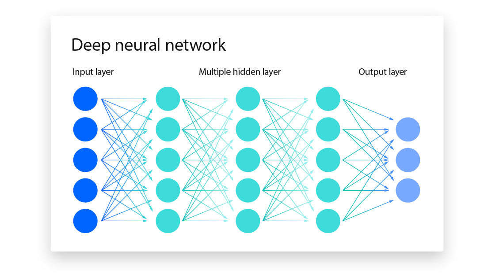

# Understanding Large Language Models {#llm-fundamentals}

In this chapter, we'll explore the fundamentals of Large Language Models (LLMs) and how they work. This knowledge will help you use LLMs more effectively and understand their capabilities and limitations.

## What Are Large Language Models?

Large Language Models are AI systems trained on massive amounts of text data to understand and generate human-like language. At their most basic level, they are sophisticated **autocomplete systems** that predict the next word (or token) in a sequence.

- **Data**: Trained on massive text corpora from the internet
- **Architecture**: Based on transformer neural networks
- **Core Function**: Essentially does next token prediction (autocomplete)

## Neural Networks: The Foundation

Before diving into LLMs, let's understand the basic building blocks. LLMs are built on **neural networks** - computing systems inspired by how our brains work.

### What is a Neural Network?

The components of a neural network are:

- **Neurons (circles)**: Each circle represents a simple computing unit that can receive information, process it, and send it forward
- **Connections (lines)**: The lines show how information flows from one neuron to another, and each line has a **weight** (like a β coefficient in regression)
- **Layers**: Neurons are organized in layers - input, hidden, and output

The thickness of the connections in the diagram represents the strength of the weights - thicker lines mean stronger influence, just like larger β coefficients in regression have more impact on the prediction.



<sup>Image source: [IBM - Neural Networks Explained](https://www.ibm.com/think/topics/neural-networks)</sup>

### How Information Flows

1. **Input Layer**: Receives the raw data (like tokenized text)
2. **Hidden Layers**: Process and transform the information through multiple steps
3. **Output Layer**: Produces the final result (like the next token prediction)

The "deep" in deep neural networks refers to having multiple hidden layers, allowing the network to learn increasingly complex patterns.

### Neural Networks vs. Traditional Regression

Think of a neural network almost like a **multi-stage OLS regression**, but much more sophisticated:

#### OLS Regression (Simple)
In a basic regression, you predict Y using: `Y = β₀ + β₁X₁ + β₂X₂ + ... + βₙXₙ`

You find the best **weights (β's)** that minimize prediction errors.

**Example**: Predicting house price = β₀ + β₁(square feet) + β₂(bedrooms) + β₃(age)
- If β₁ = 100, each extra square foot adds $100 to the price
- If β₃ = -500, each year of age reduces price by $500

#### Neural Networks (Multi-Stage)
A neural network does the same thing, but in **multiple stages**:

1. **Stage 1**: `Hidden₁ = f(β₁₁X₁ + β₁₂X₂ + ... + β₁ₙXₙ)`  
   where **f** is a simple function like **ReLU** or **Sigmoid**.
2. **Stage 2**: `Hidden₂ = f(β₂₁Hidden₁ + β₂₂Hidden₁ + ... + β₂ₘHidden₁)`  
   (again, using a simple activation function such as ReLU or Sigmoid)
3. **Stage 3**: `Output = f(β₃₁Hidden₂ + β₃₂Hidden₂ + ... + β₃ₖHidden₂)`  
   (the output layer often uses Softmax for classification tasks)

Each connection between neurons has a **weight** (a β coefficient, just like in regression), and each neuron receives inputs (the X's) from the previous layer. The output of a neuron is calculated as a weighted sum of its inputs (e.g., β₁₁X₁ + β₁₂X₂ + ... + β₁ₙXₙ), passed through an activation function (like ReLU or Sigmoid). A big difference is that in OLS regression, you can solve for the best β weights analytically in one step, while in a neural network, the model has to "train"—gradually adjusting the weights over many iterations to get better and better at minimizing prediction errors.

#### The Key Difference
- **OLS**: One stage, linear relationship
- **Neural Networks**: Multiple stages, with non-linear functions (f) between stages
- **Same Goal**: Find the best weights to minimize prediction errors

### How Neural Networks Learn

Neural networks use **supervised learning** - just like OLS regression! During training:
- **Input**: Text sequences (like "The cat sat on the")
- **Target**: The actual next word (like "mat")
- **Goal**: Adjust weights so the network predicts "mat" when given "The cat sat on the"

The network learns by comparing its predictions to the correct answers and adjusting weights to reduce errors. (Here, we're skipping over some really important details—like the process of backpropagation and stochastic gradient descent—which is how the network actually figures out how to adjust those weights. But for now, the key idea is that the network keeps tweaking its weights to get better at making predictions.)

**A great way to build intuition is to watch this short video:**

```{r, echo = FALSE}
knitr::include_url("https://www.youtube.com/embed/rEDzUT3ymw4")
```

## From Neural Networks to Language Models

Now that we understand how neural networks work, let's see how they become language models. The key insight is that instead of predicting a single Y value, language models use neural networks to predict the next word in a sequence.

Large language models also use a special architecture called a **transformer** to do this efficiently and at scale. Transformers are a big reason why modern LLMs are so powerful, but we won't go into the details of transformers here.

### The Language Modeling Task

In language modeling, the neural network:
1. Takes a sequence of words as input
2. Processes them through multiple hidden layers
3. Outputs probabilities for what the next word should be
4. The "magic" is that with enough stages and the right weights, the network can learn incredibly complex patterns in language

## How Language Models Work

Now that we understand the foundation, let's see how neural networks become language models in practice.

### Tokenization: From Text to Numbers

Before LLMs can process text, it must be converted into numbers. This process is called **tokenization**.

#### How Tokenization Works

```python
from transformers import GPT2Tokenizer

# Load the GPT-2 tokenizer
tokenizer = GPT2Tokenizer.from_pretrained("gpt2")

# Tokenize a word
inputs = tokenizer("inequality", return_tensors="pt")
print("Token IDs:", inputs.input_ids)
print("Token IDs as list:", inputs.input_ids[0].tolist())
```

#### Understanding Token IDs

Let's see what those numbers actually represent:

```python
# Convert IDs back to tokens (strings)
ids = inputs.input_ids[0].tolist()
tokens = [tokenizer.decode([i]) for i in ids]

print("IDs:", ids)
print("Tokens:", tokens)
```

You'll notice that "inequality" becomes `[500, 13237]` when using the GPT-2 tokenizer. This is specific to GPT-2—other models may use different tokenizers and produce different token IDs. This means:
- The word is split into subword tokens
- Each token gets a unique ID number
- The model works with these numbers, not the original text

#### Why Subword Tokenization?

- **Vocabulary Size**: Instead of having a token for every possible word, models use subwords
- **Unknown Words**: Can handle new words by breaking them into known subwords

### Training Large Language Models

Training LLMs involves two main stages: a large-scale pre-training phase, where the model learns general language patterns from massive text datasets, followed (optionally) by a fine-tuning stage, where the model is adapted for specific tasks or aligned with human preferences.

#### 1. Pre-training Phase

- **Data**: Massive text corpora (books, articles, websites)
- **Task**: Predict the next token in a sequence 
- **Duration**: Weeks or months on powerful hardware
- **Cost**: Millions of dollars in compute resources

During pre-training, the model is shown huge amounts of text from the web, books, and articles. For each training example, a small part of the text is hidden (masked), and the model is asked to predict the missing word or token based on the context before it.

**Example:**

Suppose the original sentence is:

> "Artificial intelligence is transforming the world."

The model might see:

> "Artificial intelligence is transforming the ____."

The model's task is to predict the missing word ("world") using the words before it. This process is repeated billions of times with different pieces of text and different masked tokens. Over time, the model learns the patterns, grammar, facts, and even some reasoning abilities from the data.

This "fill-in-the-blank" task is what enables LLMs to generate coherent and relevant text when given a prompt.


#### 2. Fine-tuning and Alignment (Optional)

- **Data**: Smaller, carefully chosen datasets focused on a domain or style  
- **Purpose**: Adapt a general-purpose model to perform specific tasks (like customer support, coding help, or medical Q&A) or to align it with human preferences (being polite, safe, and following instructions).  
- **How it works**: The base model—already trained to predict the next token—is further trained or adjusted using examples such as Q&A pairs, conversations, or code snippets. In addition to traditional fine-tuning, modern approaches often use **reinforcement learning from human feedback (RLHF)** to make the model’s behavior better match what users want.  
- **Examples**:  
  - Teaching the model to follow instructions (e.g., “Summarize this article”)  
  - Improving accuracy for domain-specific tasks (e.g., legal or medical assistance)  
  - Shaping interaction style (e.g., friendly conversation, professional tone, storytelling)  

This stage is what turns a raw “autocomplete engine” into a **useful assistant**—capable not just of predicting text, but of responding helpfully, safely, and in ways that align with human expectations.

### Next Token Prediction: The Core of LLMs

At this point, the large language model has mastered the fundamental skill of predicting what comes next in a sequence of text. Given any input text, it can generate probabilities for thousands of possible next tokens, essentially learning the patterns and relationships that govern human language.

#### Hands-On Example

Let's see this in action with GPT-2:

```python
from transformers import GPT2TokenizerFast, GPT2LMHeadModel
import torch

# Load the model and tokenizer
tokenizer = GPT2TokenizerFast.from_pretrained("gpt2")
model = GPT2LMHeadModel.from_pretrained("gpt2")

def get_next_tokens(text, num_tokens=10):
    """Get the most likely next tokens for a given text."""
    # Tokenize input
    inputs = tokenizer(text, return_tensors="pt")
    
    # Get model predictions
    with torch.no_grad():
        outputs = model(**inputs)
        logits = outputs.logits[0, -1, :]  # Last token's logits
        probabilities = torch.softmax(logits, dim=-1)
    
    # Get top predictions
    top_indices = torch.topk(probabilities, num_tokens).indices
    top_probs = torch.topk(probabilities, num_tokens).values
    
    results = []
    for idx, prob in zip(top_indices, top_probs):
        token = tokenizer.decode([idx])
        results.append((token, prob.item()))
    
    return results

# Example usage
text = "The future of artificial intelligence is"
predictions = get_next_tokens(text)

print(f"Input: '{text}'")
print("\nTop 10 most likely next tokens:")
for token, probability in predictions:
    print(f"  '{token}': {probability:.3f}")
```

#### Sampling from the Probability Distribution

When the model outputs probabilities for the next token, it doesn't always pick the most likely one. Instead, it **samples** from the probability distribution. This is crucial for creating natural, varied text.

**Example**: If the model predicts these probabilities for the next word after "The weather is":
- "sunny" (40%)
- "rainy" (30%) 
- "cloudy" (20%)
- "cold" (10%)

The model could:
- **Always pick "sunny"** (most likely) → boring, repetitive text
- **Sample randomly** based on probabilities → natural, varied text

Sampling means the model randomly selects a word, but with higher probability words being chosen more often. This creates the natural variation we see in human-like text generation.

#### Text Generation: Iterative Process

To generate longer text, LLMs repeat this process:

1. Start with initial text
2. Predict probability distribution for next token
3. Sample from the distribution (or pick the most likely)
4. Add selected token to text
5. Use new text to predict next token
6. Repeat until desired length

This is why words appear one after another, iteratively, in chatgpt.com.

## Want to learn more?


```{r, echo = FALSE}
knitr::include_url("https://www.youtube.com/embed/LPZh9BOjkQs")
```

## Next Steps

Now that you understand how LLMs work, you're ready to start using them through APIs. In the next chapter, we'll learn how to interact with commercial LLM services and build your first AI-powered applications.

The key takeaway is that LLMs are powerful tools, but they're not magic. Understanding their limitations and how they work will make you a much more effective user of these technologies.